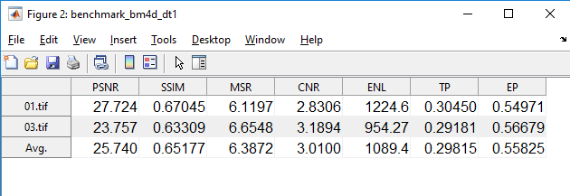

# 3D Retinal OCT Denoising Package

This is a flexible and easy to use package for 3-D denoising of retinal optical coherence tomography (OCT) images. It is also equipped with some facilities to quantitatively assess the quality of denoising.


**Requirements:**
The toolbox is almost self-contained. We tested it on a 64bit PC with Windows 10 and MATLAB 2019. For other architectures, you may need to recompile MEX files in some packages. 


**To QUICKLY see how you can run a denoising method on the first test dataset, just see `Run_benchmarks_dt1.m` or look at [here](https://github.com/ashkan-abbasi66/OCT-denoising-package/#examples)** 

**Some final denoised results are provided in `Results` folder**


This repository contains the code associated with the following manuscript which is under review:

Ashkan, Abbasi, Leyuan Fang, Hossein Rabbani, Neda Nourmohammadi, Bhavna Josephine Antony, and Hiroshi Ishikawa. **"[Mixed Multiscale BM4D for Three-dimensional Optical Coherence Tomography Denoising](./mmbm4d.pdf)."**.


## Available Methods and Datasets

**Methods**

- Sparse K-SVD [1] and [2] (For K-SVD and wavelet based initialized version see [HERE](https://sites.google.com/site/rahelekafieh/research/state-of-the-art-method-for-oct-denoising/).)
- V-BM4D [3] and [4]
- WMF [5]
- BM4D [6] and [7] 
- Tensor Dictionary Learning (Tensor DL / TDL) [8] 
- **mixed multiscale BM4D (mmBM4D)** [9] implemented via `dwt3` and `dualtree3`.

**Tested Datasets**

For downloading the datasets, refer to their original resources.

- Bioptigen Images [10]
- Topcon Images [11]
- Bioptigen Images [12]


## Conventions of this package

1 - All datasets are saved into `./Datasets` folder. 

- The first dataset (`dt1`) is stored in `./Datasets/dt1_Bioptigen_SDOCT`.
- The second dataset (`dt2`) is stored in `./Datasets/dt2_topcon_oct1000_seg_normal`.

2 - Results are being saved into `./Results` folder in which a subfolder will be created for each experiment.

3 - All of the methods are stored in `./Methods`. The following functions are provided for running the methods in an easy and unified manner:

- `benchmark_X_on_dt1`: Runs the denoising method `X` on the 1st dataset.  A function handle is used (as a input argument) to specify the denoising method (`X`).
- `benchmark_X_on_dt2`: Runs the denoising method `X` on the 2nd dataset.  

4 - There are some utility functions for objective image quality assessment. These functions are stored in `./Metrics`. After running a denoising method, you can use the following functions to evaluate the metrics for each dataset in an easy and unified manner:

- `evaluate_metrics_dt1`
- `evaluate_metrics_dt2`

5 - Runner function for each denoising method:

`[denoised_imgs,run_time] = run_...(noisy_imgs,params)`

6 - Noise estimation method used for a denoising method:

`sigma_value = estimate_noise_...(noisy_imgs)`

7 - Getting specific parameters of a denoising method:

`params = get_params_....(noisy_imgs,sigma_value)`


## Examples

You can easily run each method by the provided scripts:
- `Run_benchmarks_dt1.m` runs the selected methods on the first dataset


### Run a denoising method on the 1st dataset

**NOTE**: In `Run_benchmarks_dt1`, we provide a simple script to run every methods on the first dataset. 

#### Example 1:

Run the original BM4D on the 1st dataset to denoise two volumes which are specified by `test_indices`.

```matlab
addpath(genpath('./Methods'));
addpath('./Metrics/utils');

params.test_indices = [1,3] % denoise volume #1 and #3
params.save_mat = false; % Don't save the denoised volume as a separate MAT-file

X = @run_bm4d; % handle to the runner function for the denoising method

output_folder_name = 'benchmark_bm4d_dt1'; % it will be created in `./Results`
benchmark_X_on_dt1(output_folder_name,X,params)
evaluate_metrics_dt1(output_folder_name,params);
```

Outputs:

1. The denoised images are saved into <u>the output folder</u> (`./Results/benchmark_bm4d_dt1`)
2. The metric results are shown in a table (like below), and they are also stored in a separate Excel (`benchmark_bm4d_dt1.xlsx`) file inside the output folder. 



3. All of the command line prompts are saved into a text file (`benchmark_bm4d_dt1.txt`) inside the output folder.


### Run a denoising method on the 2nd dataset

**NOTE**: `Run_benchmarks_dt2` contains full commands to run methods on the first dataset.


- Run Sparse K-SVD on the 2nd dataset to denoise frame number 10 and 60 in the 3rd volume .

```matlab
addpath(genpath('./Methods'));
addpath('./Metrics/utils');

params.test_indices = [3];
params.frame_numbers = ones(length(params.test_indices),1)*[10, 60];

params.n_frames = 5; % greater than or equal to 2
params.valid_rows = 150:512 - 1; % images in this dataset are cropped before processing

params.save_mat = false;
    
output_folder_name = 'benchmark_ksvds_dt2';

X = @run_ksvds;
params.get_params = @get_params_ksvds;

params.noise_estimator = @(y) estimate_noise_dt2_max(y)*2 - 1;

output_folder_name = 'benchmark_ksvds_dt2';
benchmark_X_on_dt2(output_folder_name,X,params)
evaluate_metrics_dt2(output_folder_name,params);
```


# References

[1]	Rubinstein, Ron, Michael Zibulevsky, and Michael Elad. "Double sparsity: Learning sparse dictionaries for sparse signal approximation." *IEEE Transactions on signal processing* 58.3 (2009): 1553-1564.

[2]    Kafieh, Raheleh, Hossein Rabbani, and Ivan Selesnick. "Three dimensional data-driven multi scale atomic representation of optical coherence tomography." IEEE transactions on medical imaging 34, no. 5 (2014): 1042-1062.

[3]	Maggioni, Matteo, Giacomo Boracchi, Alessandro Foi, and Karen Egiazarian. "Video denoising using separable 4D nonlocal spatiotemporal transforms." In Image Processing: Algorithms and Systems IX, vol. 7870, pp. 9-19. SPIE, 2011.

[4]	Maggioni, Matteo, Giacomo Boracchi, Alessandro Foi, and Karen Egiazarian. "Video denoising, deblocking, and enhancement through separable 4-D nonlocal spatiotemporal transforms." IEEE Transactions on image processing 21, no. 9 (2012): 3952-3966.

[5]  Mayer, Markus A., Anja Borsdorf, Martin Wagner, Joachim Hornegger, Christian Y. Mardin, and Ralf P. Tornow. "Wavelet denoising of multiframe optical coherence tomography data." Biomedical optics express 3, no. 3 (2012): 572-589.

[6]	Maggioni, Matteo, and Alessandro Foi. "Nonlocal transform-domain denoising of volumetric data with groupwise adaptive variance estimation." In Computational Imaging X, vol. 8296, pp. 133-140. SPIE, 2012.

[7]	Maggioni, Matteo, Vladimir Katkovnik, Karen Egiazarian, and Alessandro Foi. "Nonlocal transform-domain filter for volumetric data denoising and reconstruction." IEEE transactions on image processing 22, no. 1 (2012): 119-133.

[8]	Peng, Yi, Deyu Meng, Zongben Xu, Chenqiang Gao, Yi Yang, and Biao Zhang. "Decomposable nonlocal tensor dictionary learning for multispectral image denoising." In Proceedings of the IEEE Conference on Computer Vision and Pattern Recognition, pp. 2949-2956. 2014.

[9] Ashkan, Abbasi, Leyuan Fang, Hossein Rabbani, Neda Nourmohammadi, Bhavna Josephine Antony, and Hiroshi Ishikawa. "Mixed Multiscale BM4D for Three-dimensional Optical Coherence Tomography Denoising.", submitted manuscript. (under review)

[10]   Fang, Leyuan, Shutao Li, Ryan P. McNabb, Qing Nie, Anthony N. Kuo, Cynthia A. Toth, Joseph A. Izatt, and Sina Farsiu. "Fast acquisition and reconstruction of optical coherence tomography images via sparse representation." IEEE transactions on medical imaging 32, no. 11 (2013): 2034-2049.

[11]   Kafieh, Raheleh, Hossein Rabbani, Michael D. Abramoff, and Milan Sonka. "Intra-retinal layer segmentation of 3D optical coherence tomography using coarse grained diffusion map." Medical image analysis 17, no. 8 (2013): 907-928.
