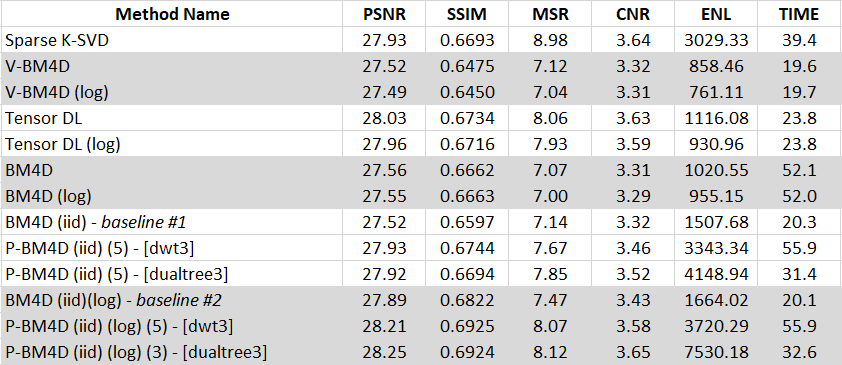

# 3D Retinal OCT Denoising Toolbox

This is a flexible and easy to use toolbox for 3-D denoising of retinal optical coherence tomography (OCT) images. It is also equipped with some facilities to quantitatively assess the quality of denoising.

 If you want to extend this toolbox, please read [here](./Readme_developers.md).


**Requirements:**
The toolbox is almost self-contained. We tested it on a 64bit PC with Windows 10 and MATLAB 2019. For other architectures, you may need to recompile MEX files in some packages. 


<a name='usage_example'></a>
# Usage Example

**Part 1: Denoising**

For each method and dataset, a separate script is provided to run the method on the dataset. Each script is named as: `benchmark_[Method Name]_[Dataset Name].m` 

As an example, let's denoise image #3 from the dataset 1 through BM4D: 

```matlab
test_indices = 3
benchmark_bm4d_dt1 % Method Name: BM4D, Dataset Name: dt1
```

The output is stored in a subfolder inside `./Results` folder. By default, the name of the subfolder is the same as the script name. To specify a different subfolder, set the `output_folder_name` variable before calling the script. 

The output folder contains: 

1. the denoised image[s]
2. the command line outputs are logged into a text (`.txt`) file. The average running time is also reported at the end of it.

**Part 2: Evaluation**

After running a denoising method on the dataset, you may want to compute some quality metrics (PSNR, SSIM, ... ). To this end, call `evaluate_metrics_[Dataset Name]` function:

```matlab
output_folder_name = 'benchmark_bm4d_dt1'
evaluate_metrics_dt1(output_folder_name,test_indices);
```

The metric results are shown in a table, and they are stored in an Excel (`.xlsx`) file inside the output folder. 


**Note**: The script `Run_benchmarks_dt1` calls all methods over the dataset 1.


# MATLAB Scripts to Run Methods

**Note**: The scripts names are in this format: `benchmark_[Method Name]_[Dataset Name].m`

- Sparse K-SVD:
  
  -  `benchmark_ksvds_dt1`
- V-BM4D
  - `benchmark_vbm4d_dt1`
  - `benchmark_vbm4d_log_dt1`: V-BM4D in the logarithm domain.
- Tensor Dictionary Learning (Tensor DL / TDL):
  - `benchmark_tensor_dl_dt1`
  - `benchmark_tensor_dl_log_dt1`: Tensor DL in the logarithm domain.

- BM4D
  -  `benchmark_bm4d_dt1`: Default BM4D with voxel-wise noise estimation.
  -  `benchmark_bm4d_log_dt1`: Default BM4D with voxel-wise noise estimation in the logarithm domain
  -  `benchmark_bm4d_iidnoise_dt1`: BM4D with i.i.d. noise assumption over the whole input volume.
  -  `benchmark_bm4d_iidnoise_log`: BM4D with i.i.d. noise in the logarithm domain.
  
- P-BM4D

  -  `benchmark_bm4d_mix_dt1`: P-BM4D implemented with 3-D discrete wavelet transform (DWT).
  -  `benchmark_bm4d_mix_log_dt1`: P-BM4D with 3-D DWT in the logarithm domain.
  -  `benchmark_bm4d_mix_dualtree3_dt1`: P-BM4D implemented with 3-D complex wavelet transform (CWT) 
  -  `benchmark_bm4d_mix_dualtree3_log_dt1`: P-BM4D with 3-D CWT in the logarithm domain.

  


# Image Quality Assessment

Here, we provide some functions to facilitate quantitatively evaluating an OCT image denoising method. 

We assume that the datasets are stored in `./Datasets` folder. 

- Dataset 1: stored in `dt1_Bioptigen_SDOCT` folder. It contains 18 OCT images captured by a Bioptigen SDOCT imaging (Durham, NC, USA) from subjects with normal and age-related macular degeneration (AMD) eyes [....].  For each test image, four noisy nearby OCT images are also provided together with a high SNR image (loosely, ground-truth image).

**Note**: Although the purpose of this toolbox is **3D denoising**, in the context of OCT image denoising, the quality metrics are usually calculated just for one image (slice) from the volume [....]. This is because ground-truth volume does not exist [...]. Therefore, here, the metrics are computed in a 2D fashion.


## Metrics

 There are functions to compute the following metrics in this toolbox:

- Widely used full reference metrics:
  - PSNR (Peak Signal-to-Noise Ratio)
  - SSIM (Structural Similarity Index)
- No reference metrics:
  - MSR (mean-to-standard-deviation ratio) [....]
  - CNR (contrast to noise ratio) 
  - ENL (equivalent number of looks)
  - TP (texture preservation)
  - EP (edge preservation) 

**Note**: The TP and EP metrics can also be used in a full reference fashion. 

- 


## Evaluate Metrics for The Outputs of a Method

To compute metrics, call `evaluate_metrics_[Dataset Name]` function as shown in the [usage example](#usage_example) above. The following scripts are currently available:

- `evaluate_metrics_dt1`: This function can be used to evaluate 5 metrics (PSNR, SSIM, MSR, CNR, and ENL) for the outputs of the most of the compared methods.

Some methods may need extra requirements:

- `evaluate_metrics_dt1_for_tensor_dl`: Most of the images in the 1st dataset have spatial resolution of 450x900 pixels. Tensor DL could not produce output with this size. This function crops the outer margins of input images before calculating the metrics. E.g., 450x900 ==`crop_image`==> 448x900.
- `evaluate_metrics_dt1_for_dualtree3`: The spatial resolution of the 9th image in the 1st dataset is 401x900 pixels. For this image, it simply removes the last column and then evaluates the metrics. 


**Note 1**: the preprocessing in `evaluate_metrics_[Dataset Name]` should match with corresponding benchmark script. 

**Note 2**: For the first dataset, the ROIs are stored here: `./Metrics/rois_for_dt1`.

**Note 3:** The best way to compute the metrics are when an output image is still in the main memory and it is not saved in a specified format such `.tif`.  This is because the quantization error might negatively affect the computations, even when the compression is not used. However, as it was practiced in the previous research works [...], here, we compute the metrics over the saved output images. 

# Results

Mean of the some metric results for denoising 18 foveal images (dataset 1) by the compared methods in this toolbox are reported in the following table. For more details, see  `benchmarks_summary_dt1.xlsx`. 

<a name='table1'></a>
**Table 1**



Description of some notations in [Table1](#table1) above:

- (log): the method is run after transforming the input volume into the logarithm domain.
- (iid): the method is run with i.i.d. noise assumption over the whole input volume.
- (number): indicates the number of decomposition scales. The decomposition is performed either using 3-D DWT (shown by [dwt3]) or 3-D CWT (shown by [dualtree3]).

The entries of [Table1](#table1) are discussed in [....] paper.


